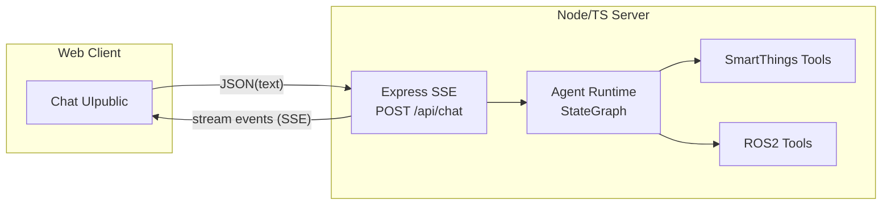
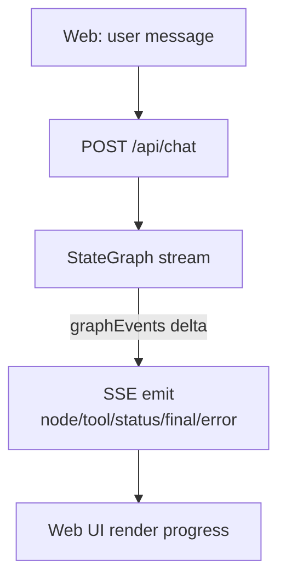
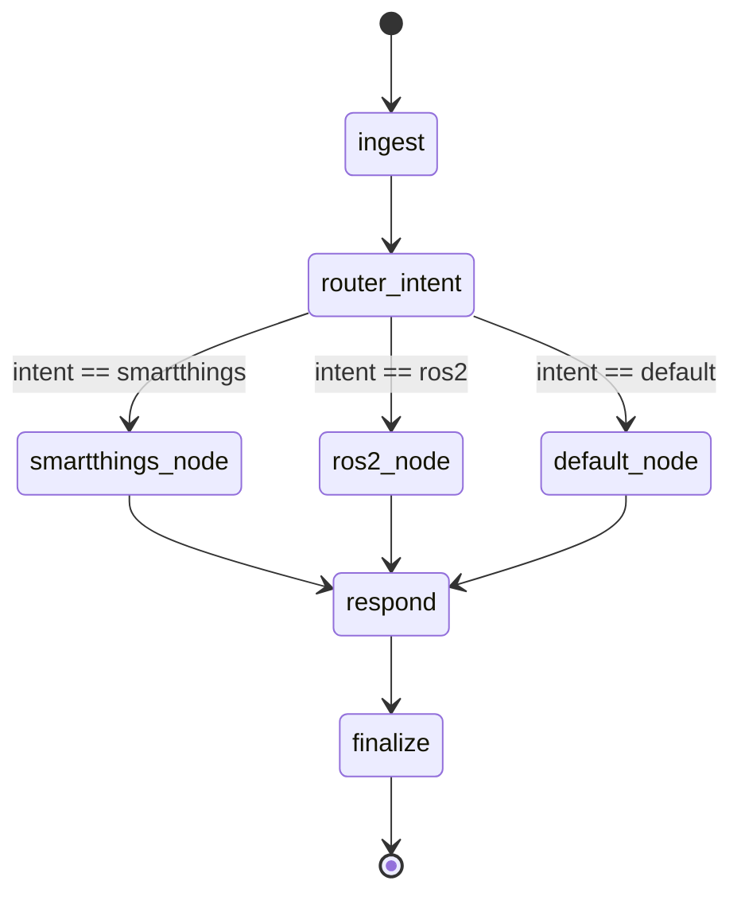
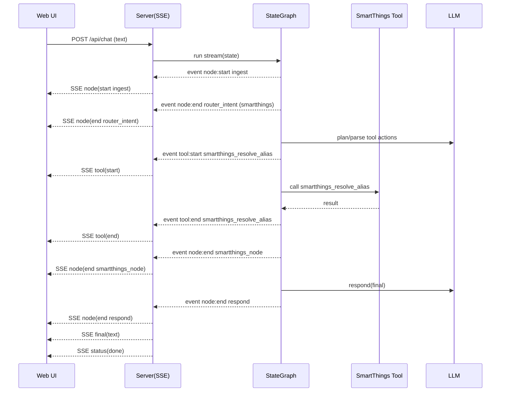

# Smart Agent (LangGraph + TypeScript) — V2 StateGraph 设计（方案 A：纯文本单 Router + 统一 Respond）

Date: 2026-05-03  
Project directory: `smart-agent-langchain-ts`

## 1. 背景与目标（再次精简：只做文本）

现状（V1）：
- 后端使用 `createReactAgent(...)`（预置 ReAct 图）实现对话与工具调用
- 通过 SSE（`POST /api/chat` 返回 `text/event-stream`）向 Web UI 推送 `status/tool/final/error` 事件

V2 的目标（方案 A：text only）：
- 使用 **自定义 LangGraph `StateGraph`**
- 使用 **单个 Router**：基于文本意图分流到 `smartthings/ros2/default`
- 三分支节点只产出结构化 `toolResults`，最终自然语言由 **统一 `respond`** 生成
- **每个 node 都向前端回传简要进度信息**（SSE `node` 事件）

非目标（V2）：
- 不做“前端确认/审批/选择设备”等交互式中断流程
- 不引入持久化数据库（仍沿用内存 session）
- 不新增复杂的长期记忆、RAG、权限系统

## 2. 核心设计原则（text only）

1) **单 Router**：`router_intent` 只做意图路由（smartthings/ros2/default）。  
2) **统一 Respond**：三分支节点只产出结构化 `toolResults`；最终自然语言由 `respond` 统一生成。  
3) **进度事件一等公民**：每个 node 只追加 `graphEvents[]`；SSE 层做“增量推送”，避免 node 直接写网络 IO。  
4) **固定收敛点**：统一收敛到 `respond -> finalize`。  
5) **意图兜底**：`router_intent` 输出置信度；低置信度直接走 `default`，并在 `respond` 里自然追问缺失信息。  

## 3. 状态模型（State）

建议的 V2 State（示意）：

```ts
type InputMessage = { kind: "text"; text: string };

type GraphEvent =
  | { type: "node"; node: string; phase: "start" | "end" | "error"; summary: string; data?: unknown; at: string }
  | { type: "tool"; name: string; phase: "start" | "end" | "error"; summary: string; data?: unknown; at: string };

type V2State = {
  sessionId: string;
  input: InputMessage;
  // 对话历史（Human/AI/Tool），用于多轮上下文
  messages: BaseMessage[];

  // 当前轮统一输入文本（本版只做文本）
  userText?: string;

  // 意图路由结果
  intent?: "smartthings" | "ros2" | "default";
  intentRationale?: string;
  intentConfidence?: "low" | "medium" | "high";

  // 结构化执行结果（供 respond 节点生成自然语言）
  toolResults?: unknown;

  // 本轮最终回答
  finalText?: string;

  // 累积事件：供 SSE 增量推送
  graphEvents: GraphEvent[];
};
```

说明：
- 本版只考虑文本：`userText = input.text`
- `toolResults` 只保存结构化 JSON；最终输出由 `respond` 节点统一生成

## 4. Node 设计

建议节点列表与职责如下：

1) `ingest`
- 校验输入（text 非空）
- 追加 `node:start/end` 事件（summary：收到消息、长度等）

2) `router_intent`（Router）
- 目标：决定本轮走 `smartthings` / `ros2` / `default`
- 推荐输出 `{ intent, rationale_short, confidence }`，低置信度则走 `default`
- 追加 `node:end` 事件（summary：意图与简要理由）

意图判断建议（写入 prompt/规则，降低误判成本）：
- **SmartThings IoT**：出现设备/房间/能力相关关键词（如 switch/light/dimmer/level/thermostat/turn on/off、设备名别名），且语气是“控制/查询状态”
- **ROS2 控制**：出现 ROS2 术语（`ros2`, `topic`, `service`, `action`, `launch`, `node` 等）或“机器人运动控制”指令风格
- **default**：其他一切；或 `confidence=low`

低置信度兜底策略：
- `intent=default` + `intentRationale` 说明“不确定是否要控制设备/机器人”
- `respond` 负责用自然语言追问 1 个最关键缺失信息（例如：要控制哪个设备？要发哪个 topic？）

3) `smartthings_node`
- 只负责：根据 `userText` 调用 SmartThings 相关工具（alias 解析、list/setSwitch/setLevel）
- 产出结构化 `toolResults`
- 将必要的 Tool 调用进度以 `GraphEvent(type:"tool")` 形式追加
- 追加 `node:end/error` 事件

4) `ros2_node`
- 只负责：根据 `userText` 调用 `ros2_get_param` / `ros2_set_param`，产出结构化 `toolResults`
- 同样追加 tool 事件与 node 事件

5) `default_node`
- 只负责：普通对话（无需工具），必要时也可调用 `skill_list/skill_read`（遵守现有安全策略）
- 产出结构化 `toolResults`（可为空）或直接产出 `finalText` 的草稿

6) `respond`
- 统一生成自然语言 `finalText`
- 输入：`userText`、`intent`、`toolResults`、以及必要的 `messages`
- 追加 `node:end` 事件（summary：完成回复生成）

7) `finalize`
- 将本轮 `Human/AI/Tool` 等消息写回 session
- 追加 `status:done` / `final` 等 SSE 兼容事件（或由外层映射）

## 5. Edge 设计（条件边，方案 A）

### 5.1 意图路由（router_intent）

- `intent === "smartthings"` -> `smartthings_node` -> `respond`
- `intent === "ros2"` -> `ros2_node` -> `respond`
- `intent === "default"` -> `default_node` -> `respond`

最后统一 `respond -> finalize -> END`

## 6. Mermaid 架构图（组件视角）



## 7. Mermaid 数据流程图（单次请求）



## 8. Mermaid 图流程（StateGraph nodes/edges）



## 9. 场景时序图（文本：SmartThings 控制）



## 10. 场景时序图（预留）

（本版暂不考虑图片输入；后续需要图片时再补充对应时序图。）

## 11. Web API 与事件协议（扩展）

### 11.1 请求（建议）

保持 `POST /api/chat`，扩展 body：

```json
{
  "sessionId": "uuid",
  "message": {
    "kind": "text",
    "text": "..."
  }
}
```

（兼容策略：如果仍发 `{text: string}`，后端自动视为 text message）

### 11.2 SSE 事件（建议新增 `node`）

保留现有：`status/tool/final/error`，新增：
- `node`：每个图节点的开始/结束/错误

事件生成职责建议：
- **Graph Runtime（nodes/tools）**：只负责追加 `state.graphEvents[]`
- **SSE 层**：只做“读取增量 events 并映射为 SSE event”，不让业务节点直接写网络 IO
- **一致性要求**：每个 node 必须发 `node:start` 与 `node:end`（异常则 `node:error`），否则前端进度会断档

示例（`event: node`）：

```json
{
  "sessionId": "uuid",
  "channel": "web",
  "type": "node",
  "payload": {
    "node": "router_intent",
    "phase": "end",
    "summary": "intent=smartthings (high confidence)"
  }
}
```

## 12. 风险与约束

- **意图分类误判**：建议 `router_intent` 输出置信度，低置信度走 `default` 并在 `respond` 中自然地澄清。
- **可观测性一致性**：要求每个 node 都必须产出 `node:start/end/error`，否则前端进度会断档。
- **工具副作用与安全**：SmartThings/ROS2 属于“有副作用工具”，建议在 `smartthings_node/ros2_node` 内加入最小安全约束（例如仅允许白名单动作/参数范围），并在 `toolResults` 中记录“执行了什么”以便追溯。

## 13. Done Criteria（V2 完成标准）

- 图结构按第 8 节节点/边实现（可在代码中清晰读到每个 node/edge）
- 前端能看到每个 node 的简要进度（SSE `node` 事件）
- 文本消息能按意图路由到 SmartThings/ROS2/default，并输出一致的最终回复
- `router_intent` 对低置信度有明确兜底（走 default + 在 `respond` 里追问最关键缺失信息）

---

## 14. 需要你确认的设计点（已确认）

1) `router_intent` 的“低置信度策略”：同意低置信度走 `default`，并在回复中自然澄清/追问最关键缺失信息。  
2) 前端展示：新增 “Graph Steps” 面板（显示 node 列表 + 当前高亮），并保留现有 tool events 作为详细日志。
